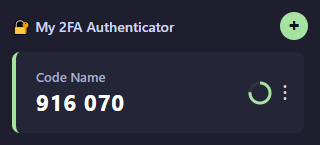

# My 2FA Authenticator

**My 2FA Authenticator** is a sleek browser extension that turns saved secret keys into working TOTP one-time passwords. It is designed to give fast and secure access to two-factor authentication codes directly from the extension popup.

---

## 🎯 Key Benefits

- Fast access to 2FA codes without opening a separate app
- Clean dark-themed interface with smooth animations
- Add service name and Base32 secret keys easily
- Click-to-copy code functionality
- Clear visual timer for code regeneration
- Edit or delete accounts directly from the popup

---

## ✨ What You See in the Previews

### 1. Code Interface

You can view your list of services, current one-time passwords, and an animated timer showing how long until the next code refreshes.

### 2. Interaction Menu

Quickly add new accounts, edit service names, or delete entries — all from a compact and intuitive interface.

---

## 🚀 How to Use

1. Open the extension in your browser.
2. Click `+` to add a new entry.
3. Enter the service name in the `Name` field.
4. Paste the secret key into the `Secret Key (Base32)` field.
5. Click `Save`.
6. Click a code to copy it to the clipboard.

---

## 🧩 Implementation Highlights

- Data stored in `chrome.storage.local`
- TOTP generation powered by `otplib-browser.js`
- Code updates every second with a smooth circular progress indicator
- Inline editing of account names and account deletion support
- Friendly and responsive popup UI

---

## ⚙️ Developer Installation

1. Open Chrome/Chromium.
2. Go to `chrome://extensions/`.
3. Enable Developer mode.
4. Click `Load unpacked`.
5. Select this project folder.

---

## 📁 Project Structure

- `manifest.json` — extension metadata and permissions
- `popup.html` — extension UI
- `popup.css` — styles and layout
- `popup.js` — generation, copy and account management logic
- `otplib-browser.js` — TOTP library
- `preview_1.png`, `preview_2.png` — interface previews

---

Create quick access to your 2FA codes and keep security at your fingertips.

---

# My 2FA Authenticator

**My 2FA Authenticator** — это стильное и простое расширение для браузера, которое превращает сохраненные секретные ключи в рабочие одноразовые коды TOTP. Идеально подходит для быстрого доступа к двухфакторной аутентификации прямо из панели расширений.

---

## 🎯 Основные преимущества

- Быстрый доступ к 2FA-кодам без открытия отдельного приложения
- Понятный интерфейс с темной темой и плавной анимацией
- Поддержка добавления имени сервиса и секретного ключа в Base32
- Моментальное копирование кода в буфер по клику
- Наглядный таймер обратного отсчета до следующей генерации
- Редактирование и удаление аккаунтов прямо из меню

---

## ✨ Что видно на превью

### 1. Интерфейс кода

Вы увидите список сервисов, текущие одноразовые коды и визуальный прогресс таймера. Цвет индикатора меняется ближе к концу окна, чтобы вы успели скопировать код.

### 2. Меню взаимодействия

Легко добавляйте новые аккаунты, редактируйте название сервиса и удаляйте ненужные записи — все в одном удобном попапе.

---

## 🚀 Как пользоваться

1. Откройте расширение в браузере.
2. Нажмите `+` для добавления новой записи.
3. Введите название сервиса в поле `Name`.
4. Вставьте секретный ключ в поле `Secret Key (Base32)`.
5. Нажмите `Save`.
6. Нажмите на код, чтобы скопировать его в буфер обмена.

---

## 🧩 Особенности реализации

- Хранение данных в `chrome.storage.local`
- Генерация TOTP-кодов через библиотеку `otplib-browser.js`
- Обновление кода каждую секунду с плавным круговым индикатором
- Поддержка редактирования имени аккаунта и удаления существующих записей
- Удобный адаптивный пользовательский интерфейс

---

## ⚙️ Установка для разработчика

1. Откройте браузер Chrome/Chromium.
2. Перейдите на `chrome://extensions/`.
3. Включите режим разработчика.
4. Нажмите `Загрузить распакованное расширение`.
5. Выберите папку этого проекта.

---

## 📁 Состав проекта

- `manifest.json` — описание расширения и разрешения
- `popup.html` — интерфейс расширения
- `popup.css` — стили и оформление
- `popup.js` — логика генерации, копирования и управления аккаунтами
- `otplib-browser.js` — библиотека для TOTP
- `preview_1.png`, `preview_2.png` — превью интерфейса

---

Создайте удобный доступ к своим 2FA-кодам и держите безопасность под рукой.

