# [EN] My 2FA Authenticator

**My 2FA Authenticator** is a browser extension that stores your 2FA secrets securely and generates one-time TOTP codes directly in the popup.

---

## 🎯 Key Benefits

- Fast access to 2FA codes without opening a separate app
- Secure access to 2FA codes with a master password
- Encrypted account storage in `chrome.storage.local`
- Temporary master password storage in `chrome.storage.session`
- Fast one-click copy of generated codes
- Add and remove accounts directly from the popup
- Clear visual timer for code refresh

---

## ✨ Preview Screenshots

### 1. First launch and master key creation
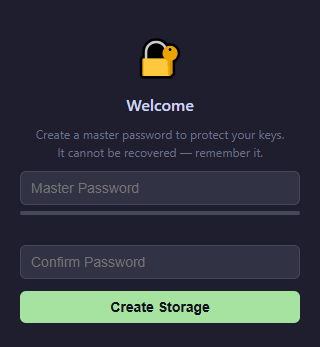

The setup screen appears on first launch, prompting the user to create a master password.

### 1.1. Weak master key demonstration
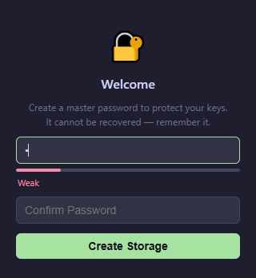

Shows a weak password strength indicator for the master key.

### 1.2. Fair master key demonstration
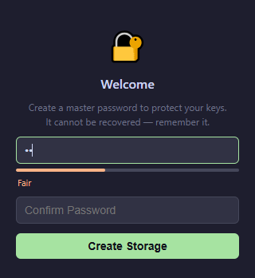

Shows a fair password strength indicator during setup.

### 1.3. Good master key demonstration
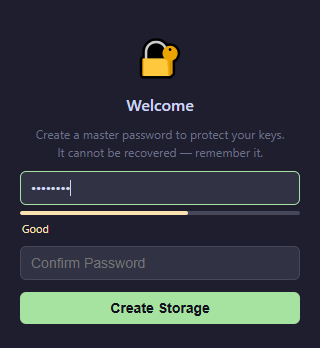

Shows a good password strength indicator during setup.

### 1.4. Strong master key demonstration
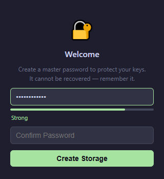

Shows a strong password strength indicator during setup.

### 1.5. Strong master key confirmation
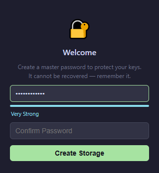

Another view of the strong password strength state.

### 2. Unlock screen
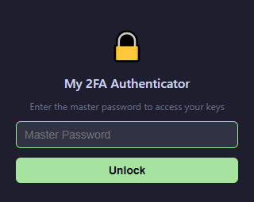

Enter the master password to unlock previously saved accounts.

### 3. First launch and empty state
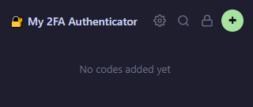

The main popup shows an empty state before any accounts are added.

### 4. Add code screen (without advanced open)
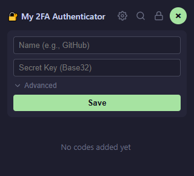

Add a new account with a simple code entry screen.

### 4.1. Add code screen with advanced open
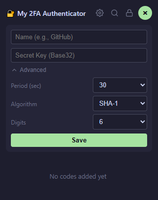

Shows the add-code screen with the advanced section expanded.

### 5. Code view without interaction menu
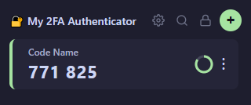

View a generated TOTP code in the main list.

### 5.1. Code view with interaction menu
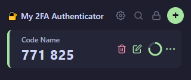

Shows the interaction menu for edit and delete actions.

### 6. Copied code state
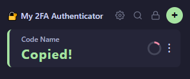

The popup shows the state after copying a code to the clipboard.

### 7. Search open
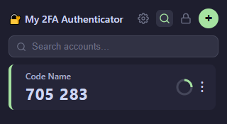

Search across saved codes in the popup.

### 8. Settings with original theme
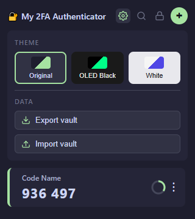

The settings page shows theme selection and export/import.

### 8.1. Settings with OLED Black theme
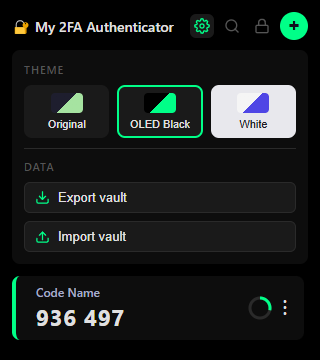

The settings page in the OLED Black theme.

### 8.2. Settings with White theme
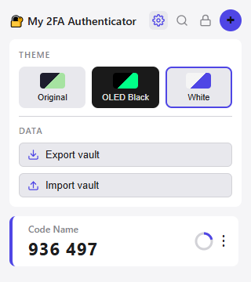

The settings page in the White theme.

---

## 🚀 What’s New in This Version

- Master password setup on first launch
- PBKDF2 + AES-GCM encryption for stored accounts
- Password unlock screen for returning users
- Lock button to hide codes and clear the session key
- Service worker background logic for secure session storage

---

## 🚀 How to Use

1. Open the extension popup.
2. On first run, create a master password.
3. Use the same password to unlock later.
4. Click `+` to add a new code.
5. Enter the service name and Base32 secret key.
6. Click `Save`.
7. Click any code to copy it to the clipboard.
8. Click the lock icon to lock the extension.

---

## 🧩 Implementation Highlights

- Data stored encrypted in `chrome.storage.local`
- Master password derived via PBKDF2 and used for AES-GCM
- Temporary session key stored in `chrome.storage.session`
- TOTP generation with `otplib-browser.js`
- Popup UI built with `popup.html`, `popup.css`, and `popup.js`

---

## ⚙️ Developer Installation

1. Open Chrome/Chromium.
2. Go to `chrome://extensions/`.
3. Enable Developer mode.
4. Click `Load unpacked`.
5. Select this project folder.

---

## 📁 Project Structure

- `manifest.json` — extension metadata, permissions, and service worker config
- `popup.html` — popup interface
- `popup.css` — popup styles
- `popup.js` — core logic for password setup, encryption, TOTP generation, and account management
- `otplib-browser.js` — TOTP library
- `background.js` — service worker handling session password storage
- `icons/` — extension icons
- `preview/` — screenshot folder
- `preview/preview_1.png`, `preview/preview_1_1.png`, `preview/preview_1_2.png`, `preview/preview_1_3.png`, `preview/preview_1_4.png`, `preview/preview_1_5.png`, `preview/preview_2.png`, `preview/preview_3.png`, `preview/preview_4.png`, `preview/preview_4_1.png`, `preview/preview_5.png`, `preview/preview_5_1.png`, `preview/preview_6.png`, `preview/preview_7.png`, `preview/preview_8.png`, `preview/preview_8_1.png`, `preview/preview_8_2.png` — interface previews

---

Create quick access to your 2FA codes and keep your secrets protected.

---

# [RU] My 2FA Authenticator

**My 2FA Authenticator** — это браузерное расширение, которое безопасно хранит ваши 2FA-секреты и генерирует одноразовые TOTP-коды прямо в popup.

---

## 🎯 Основные преимущества

- Быстрый доступ к 2FA-кодам без открытия отдельного приложения
- Безопасный доступ к 2FA-кодам через мастер-пароль
- Зашифрованное хранение аккаунтов в `chrome.storage.local`
- Временное хранение мастер-пароля в `chrome.storage.session`
- Быстрое копирование кода одним нажатием
- Добавление и удаление аккаунтов прямо из popup
- Наглядный таймер обновления кода

---

## ✨ Что видно на превью

### 1. Первый запуск и создание мастер-ключа

Экран настройки появляется при первом запуске и предлагает создать мастер-пароль.

### 1.1. Демонстрация мастера ключа weak уровня

Показывает индикатор слабого уровня пароля при вводе мастер-ключа.

### 1.2. Демонстрация мастера ключа fair уровня

Показывает индикатор пароля уровня fair во время настройки.

### 1.3. Демонстрация мастера ключа good уровня

Показывает индикатор пароля уровня good во время настройки.

### 1.4. Демонстрация мастера ключа strong уровня

Показывает индикатор пароля уровня strong во время настройки.

### 1.5. Демонстрация мастера ключа strong уровня

Еще один экран сильного мастер-ключа.

### 2. Окно ввода ключа для разблокировки

Введите мастер-пароль, чтобы разблокировать ранее сохранённые аккаунты.

### 3. Первый запуск, и пустое окно без кодов

Основное окно показывает пустое состояние до добавления аккаунтов.

### 4. Окно с добавлением кода (без открытой вкладки advanced)

Добавление нового аккаунта на простом экране ввода.

### 4.1. Окно с добавлением кода (c открытой вкладки advanced)

Показывает экран добавления кода с открытой вкладкой advanced.

### 5. Окно с кодом без открытого меню взаимодействия

Просмотр сгенерированного TOTP-кода в основном списке.

### 5.1. Окно с кодом и открытым меню взаимодействия с ним

Показывает меню для редактирования и удаления кода.

### 6. Окно с тем как выглядит когда скопировал код

Состояние после копирования кода в буфер обмена.

### 7. Окно с открытым поиском по кодам

Поиск по сохранённым кодам в popup.

### 8. Окно с открытыми настройками и оригинальной темой

Страница настроек с выбором темы и экспортом/импортом данных.

### 8.1. Окно с открытыми настройками и OLED Black темой

Настройки в теме OLED Black.

### 8.2. Окно с открытыми настройками и White темой

Настройки в теме White.

---

## 🚀 Новинки в этой версии

- Создание мастер-пароля при первом запуске
- Шифрование аккаунтов через PBKDF2 + AES-GCM
- Экран разблокировки для повторных запусков
- Кнопка блокировки для скрытия кодов и очистки сессии
- Фоновый service worker для безопасного хранения пароля в сессии

---

## 🚀 Как пользоваться

1. Откройте popup расширения.
2. При первом запуске создайте мастер-пароль.
3. Вводите пароль для последующей разблокировки.
4. Нажмите `+`, чтобы добавить новый код.
5. Укажите название сервиса и секретный ключ в формате Base32.
6. Нажмите `Save`.
7. Нажмите на любой код, чтобы скопировать его.
8. Нажмите значок замка, чтобы заблокировать расширение.

---

## 🧩 Особенности реализации

- Данные хранятся зашифрованными в `chrome.storage.local`
- Мастер-пароль выводится через PBKDF2 и используется для AES-GCM
- Временный ключ хранится в `chrome.storage.session`
- Генерация TOTP выполняется через `otplib-browser.js`
- UI popup реализован в `popup.html`, `popup.css` и `popup.js`

---

## ⚙️ Установка для разработчика

1. Откройте Chrome/Chromium.
2. Перейдите на `chrome://extensions/`.
3. Включите режим разработчика.
4. Нажмите `Загрузить распакованное расширение`.
5. Выберите папку этого проекта.

---

## 📁 Состав проекта

- `manifest.json` — метаданные расширения, разрешения и конфигурация сервис-воркера
- `popup.html` — интерфейс popup
- `popup.css` — стили popup
- `popup.js` — логика мастер-пароля, шифрования, генерации TOTP и управления аккаунтами
- `otplib-browser.js` — библиотека TOTP
- `background.js` — сервис-воркер для хранения пароля в сессии
- `icons/` — иконки расширения
- `preview/` — папка со скриншотами
- `preview/preview_1.png`, `preview/preview_1_1.png`, `preview/preview_1_2.png`, `preview/preview_1_3.png`, `preview/preview_1_4.png`, `preview/preview_1_5.png`, `preview/preview_2.png`, `preview/preview_3.png`, `preview/preview_4.png`, `preview/preview_4_1.png`, `preview/preview_5.png`, `preview/preview_5_1.png`, `preview/preview_6.png`, `preview/preview_7.png`, `preview/preview_8.png`, `preview/preview_8_1.png`, `preview/preview_8_2.png` — превью интерфейса

---

Создавайте быстрый доступ к вашим 2FA-кодам и храните секреты под защитой.
